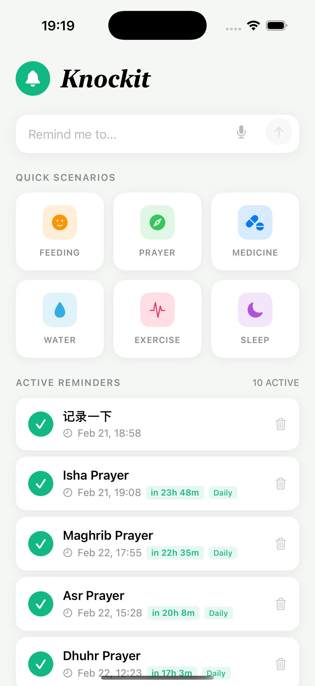
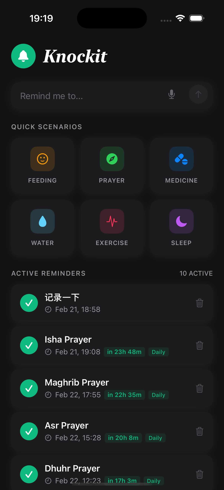

# Knockit

An AI-powered reminder app for iOS built with SwiftUI.

Type anything naturally — Knockit uses Google Gemini to understand and schedule your reminders automatically.

<p align="center">
  
  &nbsp;&nbsp;&nbsp;
  
</p>

## Features

- **Natural language input** — Type "remind me to drink water in 30 minutes" and Gemini parses it into a scheduled reminder
- **Quick scenarios** — One-tap templates for Feeding, Prayer, Medicine, Water, Exercise, Sleep
- **Prayer times** — Fetches accurate daily prayer times based on your location (Aladhan API)
- **Local notifications** — Works in the background; supports one-time, daily, weekly, and interval repeats
- **Countdown display** — Each reminder shows how long until it fires ("in 2h 30m")
- **Edit & manage** — Tap any reminder to edit title, time, and repeat rule
- **Dark mode** — Full adaptive dark mode support

## Setup

1. Clone the repo
2. Open `Knock.xcodeproj` in Xcode
3. Add your Gemini API key in `Knock/Config/APIKeys.swift`:
   ```swift
   static let geminiAPIKey = "YOUR_KEY_HERE"
   ```
4. Select your device and press ⌘R

## Run on device

```bash
./run.sh
```

## Tech Stack

| Layer | Technology |
|---|---|
| UI | SwiftUI |
| Data | SwiftData |
| AI | Google Gemini 2.0 Flash (REST) |
| Notifications | UNUserNotificationCenter |
| Prayer times | Aladhan API |
| Location | CoreLocation |

## Requirements

- iOS 17+
- Xcode 15+
- Gemini API key ([get one free](https://aistudio.google.com/app/apikey))
